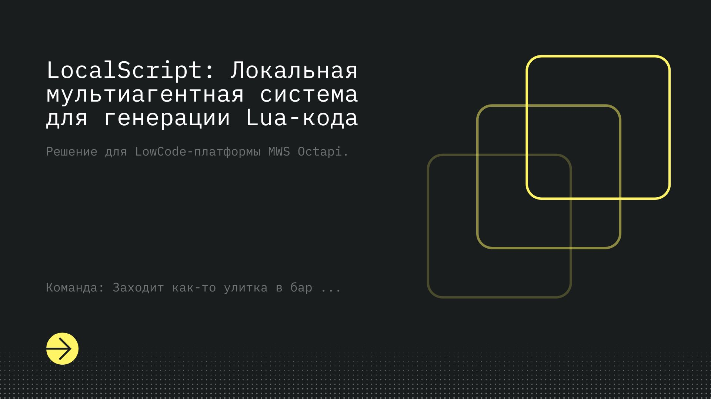

# 🚀 LocalScript: Локальная мультиагентная система для генерации Lua-кода


**LocalScript** — это AI-решение для LowCode-платформы (MWS Octapi), работающее **полностью в закрытом контуре**. Оно переводит задачи с естественного языка в готовый к использованию Lua-скрипт, опираясь на корпоративную базу знаний и строгие правила синтаксиса.

## 🛡 Выполнение требований хакатона

- **Модель:** `qwen2.5-coder:7b-instruct` (квантованная, загружается локально).
- **Параметры запуска Ollama (фиксированные):** `num_ctx=4096, num_predict=512, batch=1, parallel=1`.
- **Потребление ресурсов:** Вся генерация выполняется на GPU (без CPU offload). Пиковое потребление **≤ 8.0 GB VRAM**. Эмбеддинги (FastEmbed) и векторная БД (Qdrant) вынесены на CPU.
- **Внешние API:** Полностью отсутствуют.

## ⚡ Quick Start

### Требования

- Docker & Docker Compose
- NVIDIA GPU (8 GB VRAM) + NVIDIA Container Toolkit

### Запуск (One-Click)

1. Клонируйте репозиторий.
2. Поднимите инфраструктуру (модель скачается автоматически на этапе инициализации):

   ```bash
   docker compose up --build
   ```

3. **⏳ ВАЖНО:** При первом запуске сервис `init` выполнит `ollama pull qwen2.5-coder:7b-instruct` и загрузит базу знаний в Qdrant. Бэкенд API будет доступен **только после того**, как в консоли появится ASCII-арт `Local Script`.

## 🎮 Демонстрации и Тестирование

Чтобы жюри могло проверить качество генерации, мы написали **локальный эмулятор песочницы MWS**.
Выберите сценарий:

👉 **[Демонстрация 1: Работа эндпоинта /generate (Single-shot)](examples/ex1/README.md)**  
👉 **[Демонстрация 2: Продуктовая задача через Human-in-the-Loop (Chat UI)](examples/ex2/README.md)**

## 🧠 Архитектура "Под капотом"

Система построена на базе 4 "агентов", управляемых чистым Python-бэкендом без тяжеловесных фреймворков вроде LangChain:

1. 🧐 **Аналитик:** Проверяет запрос. Если ТЗ неполное, задает пользователю уточняющий вопрос.
2. 📚 **RAG-модуль:** Ищет релевантные примеры скриптов в локальной БД `Qdrant` (векторизация на CPU).
3. 💻 **Кодер (`Qwen2.5-Coder`):** Пишет код строго по `LUA_BEST_PRACTICES`.
4. 🛠 **Фиксер + Чекер:** Python прогоняет код через локальный компилятор `luac`. При ошибке Фиксер чинит баг в цикле. Пользователь получает только 100% рабочий синтаксис.

[![](https://mermaid.ink/img/pako:eNqNVW1rG0cQ_ivLhoAEd7JOp9fDGFw7TVzk2qnsfmiuH1a6lSVyulNXJxLXMig2aQMKuLRfQgtNC_lauKQ2UWTL-Qt7_6gzu3IsFwtyQtzu3uzMM888s3tAG6HHqUP3BOu2yM66GxB47t4l8k_5MRnKM3kK_3P4T-VYnhH5UV7K8-SlfA_vdzJOjvBzcqL37fa4SD1yqXx9q9VLskTkXzKW78FzLN_Ky-Qo-Rn8TpbrYmklJd_AylBeJMcQcZwM4X2WHBHwEgOMGE0N8qDfYYHZDsyoxc1qGHbTLv0-7QYaQa9f16lUwwbzaw3R7kYEEM1Pa_u9iHdISr5S-FQojROSnCYj-UGHnACCESBUCxOwmMLkOBliQB0Nn-sRsvY7mF0okqbIGe4myTOI8ExxcJGMru3XWiwCaMv1ld0NYAanZCOIuGiyBl9eqq9oVmqR4KzjtyNDsQ-gjki5kLXS6rN8hY6RT3iPIYlZAqcwiSG3S_nvArir2xs6-uoeD6Ie2RKNFu9FgkWhuI7-JetFYDkL9gf6w4LJ2CHyF0gyVvxh6Imh0z9FODB-g2uQO8wyevc_QM1bJSlEN0VPJLW2vZvGzGY1wFTAO_H7rLEA-ENPsCB6lHJpav2LNIEMvuUNAE3WWcTqrDfHnTadI65o27bO5ZvV-2byQsnwXNV2RAAOzGIsPipgqgQxlh9cmr4VyJbvsw7TJCqBkWp1k9wL9trBHAZtNYfBsvJ2XoP44QkPcpmCiV0onFIddA0V6DcikroPvCgCbgrsV0B6DLIaqpbUTQkkv0tOAPH4prjIsmmuDKAZz2adjC0UX3ENMoW6Aecqb61QbL-xHGuC7tV2UCQgza9qW18PcHxDPZ_cX-JuOSEqCp4VqpXAHZCaPNfxxhDvTNdYNxOgUWEe7OxsQwgox2BW2duC_KbS1Tr_CcKdkGqfmbc50lg16doTD7wrFmcMgqMXC7jDI4yYpjkAO3X44QE010wEwwwUvf_f8Bqqe4ItjuckHiCKZ-B1RJagxTh0FifI6ozKa0h_qwaCRsJtOr_ZcRbt-_zGWdZs-75zp1nBnwFaCR9z5w6IejY2n7S9qOXkuk-vFjzWazEh2L5DCqQw71Yh1_6y5XyuVDcaoR8K8N5sztspKWk7yyqW694CO6zWZ5jpIn-OpS7iIktqwK3V9qgDDcMN2uGiw3BKD9CHS-F-6HCXOjD0mHjsUkOv42QT-g0_4VY3OARXXRZ8F4adK28i7O-1qNNkfg9m_a4HtVtvM7hbOp9WBQiLi7WwH0TUsUtZ5YQ6B_QpdSwrk68US_lKuVSq5CrFctmg-7CctTNWuVAq5MrFcrGQs_OHBv1RxbUyWdu2srlSpWDliyXbsg3KvTaca5v6ilY39eF_ktdbjA?type=png)](https://mermaid.live/edit#pako:eNqNVW1rG0cQ_ivLhoAEd7JOp9fDGFw7TVzk2qnsfmiuH1a6lSVyulNXJxLXMig2aQMKuLRfQgtNC_lauKQ2UWTL-Qt7_6gzu3IsFwtyQtzu3uzMM888s3tAG6HHqUP3BOu2yM66GxB47t4l8k_5MRnKM3kK_3P4T-VYnhH5UV7K8-SlfA_vdzJOjvBzcqL37fa4SD1yqXx9q9VLskTkXzKW78FzLN_Ky-Qo-Rn8TpbrYmklJd_AylBeJMcQcZwM4X2WHBHwEgOMGE0N8qDfYYHZDsyoxc1qGHbTLv0-7QYaQa9f16lUwwbzaw3R7kYEEM1Pa_u9iHdISr5S-FQojROSnCYj-UGHnACCESBUCxOwmMLkOBliQB0Nn-sRsvY7mF0okqbIGe4myTOI8ExxcJGMru3XWiwCaMv1ld0NYAanZCOIuGiyBl9eqq9oVmqR4KzjtyNDsQ-gjki5kLXS6rN8hY6RT3iPIYlZAqcwiSG3S_nvArir2xs6-uoeD6Ie2RKNFu9FgkWhuI7-JetFYDkL9gf6w4LJ2CHyF0gyVvxh6Imh0z9FODB-g2uQO8wyevc_QM1bJSlEN0VPJLW2vZvGzGY1wFTAO_H7rLEA-ENPsCB6lHJpav2LNIEMvuUNAE3WWcTqrDfHnTadI65o27bO5ZvV-2byQsnwXNV2RAAOzGIsPipgqgQxlh9cmr4VyJbvsw7TJCqBkWp1k9wL9trBHAZtNYfBsvJ2XoP44QkPcpmCiV0onFIddA0V6DcikroPvCgCbgrsV0B6DLIaqpbUTQkkv0tOAPH4prjIsmmuDKAZz2adjC0UX3ENMoW6Aecqb61QbL-xHGuC7tV2UCQgza9qW18PcHxDPZ_cX-JuOSEqCp4VqpXAHZCaPNfxxhDvTNdYNxOgUWEe7OxsQwgox2BW2duC_KbS1Tr_CcKdkGqfmbc50lg16doTD7wrFmcMgqMXC7jDI4yYpjkAO3X44QE010wEwwwUvf_f8Bqqe4ItjuckHiCKZ-B1RJagxTh0FifI6ozKa0h_qwaCRsJtOr_ZcRbt-_zGWdZs-75zp1nBnwFaCR9z5w6IejY2n7S9qOXkuk-vFjzWazEh2L5DCqQw71Yh1_6y5XyuVDcaoR8K8N5sztspKWk7yyqW694CO6zWZ5jpIn-OpS7iIktqwK3V9qgDDcMN2uGiw3BKD9CHS-F-6HCXOjD0mHjsUkOv42QT-g0_4VY3OARXXRZ8F4adK28i7O-1qNNkfg9m_a4HtVtvM7hbOp9WBQiLi7WwH0TUsUtZ5YQ6B_QpdSwrk68US_lKuVSq5CrFctmg-7CctTNWuVAq5MrFcrGQs_OHBv1RxbUyWdu2srlSpWDliyXbsg3KvTaca5v6ilY39eF_ktdbjA)

## ⚙️ Управление знаниями (Prompts & RAG)

Вся логика вынесена в папку `prompts/`. Меняйте поведение системы "на лету":

- `agents.json` — Системные промпты агентов.
- `LUA_BEST_PRACTICES.md` — Жесткие правила (запреты, работа с `wf.vars`).
- `examples.json` — База данных для RAG. При рестарте контейнеров автоматически векторизуется.
